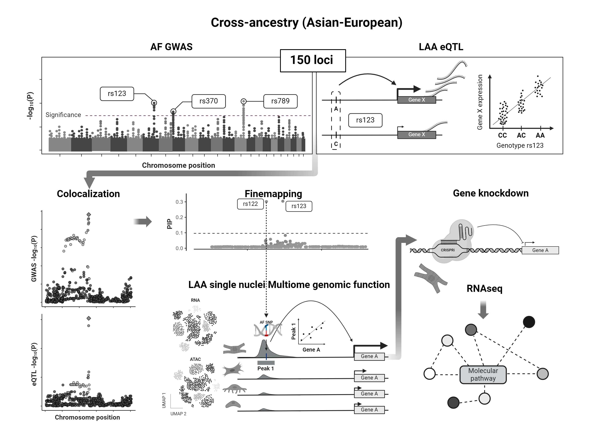

# Atrial Fibrillation Variant-to-Gene Prioritization

This repository contains the code used to generate the results for the publication:

**"Atrial fibrillation variant-to-gene prioritization through cross-ancestry eQTL and single-nucleus multiomic analyses."**

## Graphical Abstract

## Overview

Atrial fibrillation (AF) is the most common arrhythmia globally. Identifying causal genes and their functions remains challenging despite strong therapeutic candidates from human genetics. We applied an AF fine-mapping strategy using cross-ancestry GWAS results, eQTLs from left atrial appendages (LAAs) of two cohorts with distinct ancestries, and paired RNAseq and ATACseq LAA single-nucleus assays (sn-multiome). Our analyses implicated 14 genes at nine AF loci and identified several candidate causal AF variants, including rs7612445 at GNB4 and rs242557 at MAPT. Repressing the strongest AF-associated eQTL gene, LINC01629, in human embryonic stem cell-derived cardiomyocytes using CRISPR inhibition led to dysregulation of pathways linked to atrial tissue development and cardiac conduction system genes.

## Repository Contents

- **scripts/**: Contains Bash scripts used for data preprocessing.
- numbered RMarkdown notebooks were used to generate figures (in corresponding figs/directory_names) and results.

## Important Note on Data Availability

Due to the sensitive nature of genetic data used in this study, most analyses will not be fully reproducible as the raw genetic data cannot be shared. Researchers interested in accessing the original data for validation or further studies may contact us for potential collaboration opportunities, subject to appropriate data sharing agreements and ethical considerations. 

## Contact

For questions, collaborations, or further information, please contact the corresponding authors
